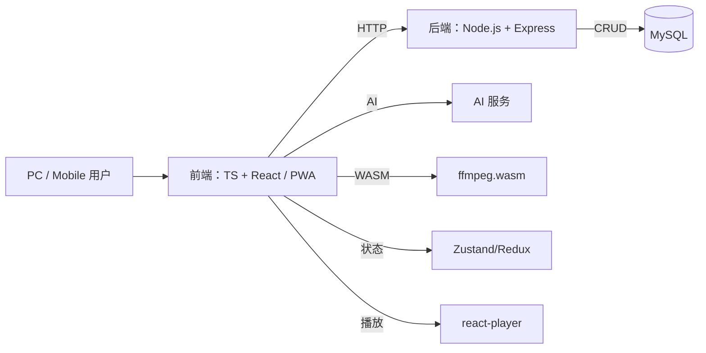

# 自媒体营销工具前端需求文档

## 1. 概述

本工具聚焦前端能力，通过 TypeScript + React 实现自媒体全流程运营支撑，支持桌面与移动端（响应式或 PWA）使用。前端负责：

- 关键词检索
- 标题生成
- 内容创作（调用 AI API）
- 脚本规划
- 拍摄管理
- 视频剪辑预览
- 任务流转与导航

整个视频制作过程在前端以“任务”形式管理，用户在导航栏中切换环节（关键词 → 标题 → 内容 → 脚本 → 拍摄 → 剪辑），各阶段数据通过 API 与后端 MySQL 同步存储，实现持久化与多端共享。

```
任务导航：
关键词检索 → 标题生成 → 内容创作 → 脚本规划 → 拍摄管理 → 视频剪辑预览
```

---

## 2. 功能模块

### 2.1 任务与导航

- **任务定义** ：一个视频项目即为一个任务，含全流程数据与状态。
- **导航栏** ：步骤菜单，用于切换并显示当前环节进度。
- **状态管理** ：任务上下文通过 Zustand / Redux 存储，本地仅作缓存，主要通过 REST API 同步到后端 MySQL。
- **流转逻辑** ：完成当前环节后，前端请求 POST/PUT API 更新任务状态与数据，下一步骤解锁。

### 2.2 关键词检索 UI

- **输入** ：主题词或领域标签。
- **调用** ：小红书 / 巨量 API（fetch）。
- **展示** ：
- 热门关键词列表（标签云），支持点选。
- 同义/长尾词标签云，支持点选。
- 趋势和竞争度简易图表（Recharts）。
- **交互** ：
- 点击关键词标签，可单个或批量选中。
- 选中关键词会加入到当前任务的关键词池或直接传递到标题生成组件。
- 支持取消选中，并实时更新选中列表。
- **任务绑定** ：选中关键词通过 API 存入 MySQL，并更新本地任务上下文。

### 2.3 标题生成组件 标题生成组件

- **配置面板** ：选择关键词、用户画像、场景、表达手法、心理触发点。
- **调用** ：前端调用 AI 标题生成 API（POST `/api/ai/title-gen`），传入配置参数。
- **展示** ：5 ～ 10 条多维度候选标题，支持复制/A/B 标记。
- **任务绑定** ：选中标题通过 API 更新到 MySQL。

### 2.3 心理学模型配置界面

- **目标** ：管理和配置各类心理学模型，为标题和内容生成提供触发点与参数。
- **功能** ：

1. 模型列表：展示已有心理学模型（如费奥格行为模型、马斯洛需求层次理论、Cialdini 影响力原则等）。
2. 模型管理：
   - 新建：输入名称、描述、参数字段（权重、阈值等）。
   - 编辑：修改模型参数与启用状态。
   - 删除：移除不再使用的模型。
3. 参数配置：针对每个模型，定义默认触发点标签（好奇、恐惧、奖励、社交等）。
4. 模型启用：全局或任务级别启用/禁用模型，为生成组件提供可选列表。
5. API 同步：通过 `/api/models/psychology` GET/POST/PUT/DELETE 接口与后端 MySQL 交互。

- **交互** ：
- 点击模型名称，可展开查看参数详情并进行编辑。
- 切换开关启用模型，影响标题和内容生成中的心理触发点选项。
- 支持按名称、类型、启用状态筛选。
- **任务集成** ：在标题生成与内容创作界面，侧边栏展示当前激活模型列表，点击可快速配置或跳转到模型管理界面。

### 2.4 内容创作编辑器

- **富文本编辑** ：基于 `@tiptap/react`。
- **智能建议** ：调用 AI 文本生成 API（POST `/api/ai/content-gen`），输入关键词、技巧、心理学原则。
- **脚本分镜预览** ：自动拆分镜头，支持拖拽顺序调整。
- **任务绑定** ：最终文案与分镜通过 API 存储到 MySQL。

### 2.5 脚本规划视图

- **时间轴组件** ：秒级/帧级刻度。
- **分镜卡片** ：编辑画面描述、台词、拍摄参数。
- **导出** ：下载 PDF 或打印版脚本。
- **任务绑定** ：脚本数据通过 API 同步到 MySQL。

### 2.6 拍摄管理面板

- **任务列表** ：分段镜头清单。
- **摄像头接入** ：WebRTC 调用本地摄像头，兼容移动端 MediaDevices API。
- **远程推流** ：手机扫码连接功能。
- **媒体存储** ：视频片段本地缓存，元数据通过 API 存储 MySQL；可选上传后端存储。
- **任务绑定** ：拍摄片段信息通过 API 更新任务上下文。

### 2.7 视频剪辑与预览

- **客户端剪辑** ：集成 `ffmpeg.wasm`，实现拼接、裁剪、转场。
- **字幕与配乐** ：支持本地上传 SRT、背景音乐。
- **预览** ：`react-player` 播放合成结果。
- **导出** ：一键下载 MP4。
- **任务完成** ：标记任务完成，通过 API 更新状态。

### 2.8 移动端适配

- **响应式设计** ：移动优先，使用 CSS Grid/Flexbox、Tailwind CSS 或 Chakra UI 断点。
- **PWA 支持** ：Service Worker 离线缓存，安装到主屏幕。
- **触控优化** ：更大按钮、手势滑动支持。
- **摄像头兼容** ：MediaDevices API 在移动浏览器中的权限处理。

### 2.9 API 配置模块

- **目标** ：提供一个可扩展的接口配置模块，支持 GET、POST、流数据（STREAM）等主流请求方式，便于后续快速增删接口。
- **功能** ：

1. 定义接口配置对象：包含 `name`、`method`、`path`、`headers`、`params`、`stream` 等字段。
2. 动态注册/注销：通过配置文件或调用注册函数，动态增加或删除接口映射。
3. 请求封装：基于 `axios` 或 `fetch` 封装通用 `request(config)` 方法，自动处理重试、超时、鉴权。
4. 响应处理：统一拦截及错误处理，支持回调与 Promise 链式调用。

- **示例** ：

```ts
interface ApiConfig {
  name: string
  method: 'GET' | 'POST' | 'STREAM'
  path: string
  headers?: Record<string, string>
  params?: Record<string, any>
  stream?: boolean
}

const apiRegistry: Record<string, ApiConfig> = {}

// 注册接口
function registerApi(config: ApiConfig) {
  apiRegistry[config.name] = config
}

// 注销接口
function unregisterApi(name: string) {
  delete apiRegistry[name]
}

// 发起请求
async function request(name: string, data?: any) {
  const cfg = apiRegistry[name]
  return axios({
    url: cfg.path,
    method: cfg.method,
    headers: cfg.headers,
    params: cfg.params,
    data,
    responseType: cfg.stream ? 'stream' : 'json',
  })
}
```

### 2.10 路由模块

- **目标** ：实现多层级路由管理，支持任务各环节及子页面导航。
- **功能** ：

1. 多级路由：主流程导航如 `/tasks/:taskId/step/:step`，以及子路由（详情、设置等）。
2. 动态路由注册：根据任务状态动态加载和卸载路由组件。
3. 路由守卫：拦截未完成前置步骤的非法访问，保证环节顺序。
4. 与任务导航联动：路由变更自动同步任务上下文进度，反向导航时亦更新状态。

- **实现** ：
- 采用 `react-router`（v6）或 Next.js App Router，配置嵌套路由。
- 定义 `Route` 配置数组，通过 `useRoutes` 或 `next/link` 实现导航切换。
  例如：

```ts
const routes = [
  {
    path: '/tasks/:id',
    element: <TaskLayout />,
    children: [
      { path: 'step/:step', element: <StepComponent /> },
      { path: 'settings', element: <TaskSettings /> },
    ],
  },
]

function AppRouter() {
  const element = useRoutes(routes)
  return <BrowserRouter>{element}</BrowserRouter>
}
```

---

## 3. 前端技术栈与架构



- **框架** ：React (Next.js 或 Vite)
- **语言** ：TypeScript
- **状态管理** ：Zustand / Redux Toolkit
- **HTTP 客户端** ：axios / fetch
- **UI 组件库** ：Chakra UI / Ant Design / Tailwind CSS
- **富文本** ：Tiptap
- **图表** ：Recharts
- **摄像头** ：WebRTC & MediaDevices API
- **剪辑** ：ffmpeg.wasm
- **视频播放** ：react-player
- **PWA** ：Workbox + Web App Manifest
- **测试** ：Jest + React Testing Library

---

## 4. 迭代里程碑

| 阶段 | 功能                         | 输出形式          | 时间节点 |
| ---- | ---------------------------- | ----------------- | -------- |
| 1    | 项目搭建 & 响应式导航框架    | Task 导航 Demo    | D+7      |
| 2    | 关键词检索 UI & 存储到 MySQL | UI & API Demo     | D+14     |
| 3    | 标题 & 内容 AI API 调用      | API 调用 Demo     | D+21     |
| 4    | 脚本规划 & PDF 导出          | 脚本导出功能      | D+28     |
| 5    | 拍摄管理 & WebRTC 移动兼容   | 拍摄 Demo         | D+35     |
| 6    | 客户端剪辑 & 预览            | ffmpeg.wasm Demo  | D+42     |
| 7    | PWA 离线 & 触控优化          | PWA Demo          | D+49     |
| 8    | 完整流程联调 & E2E 测试      | 流程联调报告      | D+56     |
| 9    | 发布 & 文档完善              | 发布版本 + README | D+63     |

_已更新存储方案为 MySQL，所有关键数据通过后端 API 持久化_
